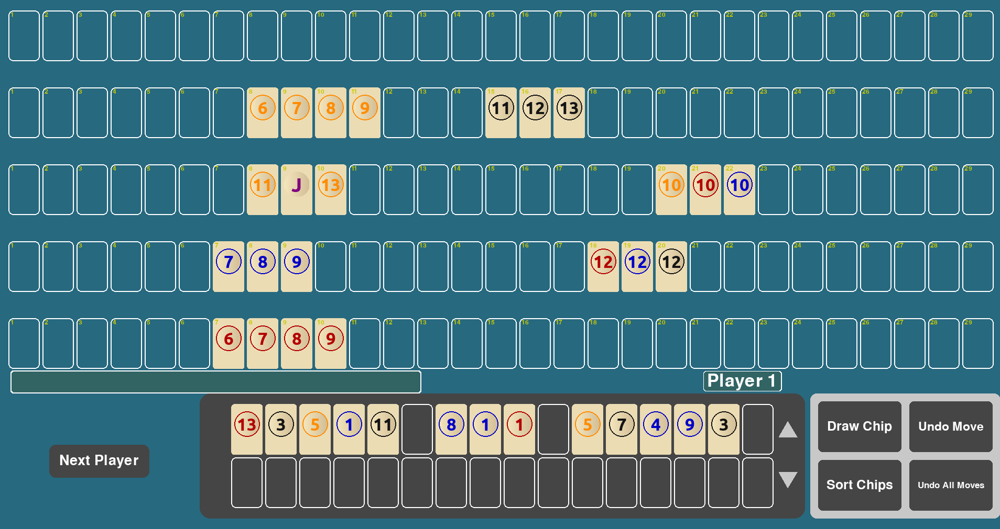

# Rummikub 
This is a personal project created to practice object-oriented programming (OOP) in Python. The logic is based on the game Rummikub.


### About Rummikub:

Rummikub is a tile-based game. Players try to be the first to play all their tiles by forming valid sets:

Groups: tiles with the same number in different colors

Runs: tiles in numerical order of the same color

Each tile is numbered from 1 to 13 with four different colors. There are two copies of each tile and 2 jokers. Players start with a hand of 14 tiles. The first move must have tiles that add up to at least 30 points, tiles of other players can be used for this. 

On each turn, a player can play tiles or draw one from the pool.

### Current features:

Generation of a full Rummikub tile set (including jokers)

Tile shuffling and drawing mechanism

Player hand management

Basic game loop and turn-taking logic

Formation of valid groups and runs

Simple terminal interaction (if used)

## How to run
Install the requirements:
```bash
pip install -r requirements.txt
```
Run the game
```bash
python main.py
```
